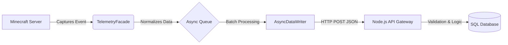

# CobbleAnalytics (ServerBrain)

**CobbleAnalytics** is a high-performance, server-side telemetry client designed for **Cobblemon** (Fabric 1.21.1).

Unlike traditional loggers, CobbleAnalytics functions as a **Big Data ingestion agent**. It captures rich, contextual "Behavioral Data" in real-time and flushes it asynchronously to a central **Node.js API Endpoint**, completely decoupling the game server from the database layer.

## 🚀 Core Philosophy

* **Thin Client Architecture:** The Minecraft server is **not** responsible for database management. It simply collects data and ships it out.
* **Zero-Lag Policy:** Network I/O is handled by a dedicated `AsyncDataWriter` thread. The main game loop is never blocked by API calls.
* **Context is King:** We capture deep metadata (IVs, Biomes, Team Status) as structured JSON payloads.
* **Security:** No database credentials exist on the game server instance.

## 🏗 System Architecture

The system uses a decoupled Microservices approach.



### Data Flow

1. **Ingest:** Mixins intercept game events (e.g., `PokemonCapturedEvent`).
2. **Buffer:** Events are serialized into JSON Records and pushed to a `LinkedBlockingQueue`.
3. **Dispatch:** A worker thread drains the queue and sends batch `POST` requests to the API.

---

## 📡 Event Catalog (Payload Specifications)

The following JSON structures are the exact payloads sent to the API.

### A. Pokemon Lifecycle

*Purpose: Analyze asset valuation, spawn rates, and economy sources.*

#### 1. `POKEMON_CAUGHT`

Triggered when a player successfully captures a wild Pokémon.

```json
{
  "playerUUID": "uuid-string",
  "pokemonUuid": "uuid-string",
  "species": "charmander",
  "level": 15,
  "nature": "adamant",
  "ability": "blaze",
  "shiny": false,
  "ivs": { "hp": 31, "atk": 10, "def": 20, ... },
  "ballUsed": "poke_ball",
  "pokedexCompletion": 12.5,
  "biome": "minecraft:plains",
  "world": "minecraft:overworld",
  "timestamp": 1700000000000
}

```

#### 2. `POKEMON_RELEASED`

Triggered when a Pokémon is released from the PC or party.

* **Note:** `timeHeldCalculated` is pre-calculated by the mod before sending.

```json
{
  "pokemonUuid": "uuid-string",
  "species": "pidgey",
  "level": 5,
  "shiny": false,
  "ivs": { ... },
  "playerName": "Steve",
  "playerUuid": "uuid-string",
  "timeHeldCalculated": 45000, // ms held by player
  "biome": "minecraft:forest",
  "world": "minecraft:overworld",
  "timestamp": 1700000000000
}

```

#### 3. `POKEMON_HATCHED`

Triggered when an egg hatches.

```json
{
  "pokemonUuid": "uuid-string",
  "species": "togepi",
  "shiny": true,
  "ivs": { ... },
  "ability": "serene_grace",
  "nature": "modest",
  "ballInherited": "luxury_ball",
  "playerUuid": "uuid-string",
  "world": "minecraft:overworld",
  "biome": "minecraft:plains",
  "timestamp": 1700000000000
}

```

### B. Combat & Raids

*Purpose: Balance PvE difficulty and analyze competitive meta.*

#### 4. `BATTLE_END`

Triggered at the end of any battle (PvE, PvP, Wild).

```json
{
  "battleId": "uuid-string",
  "playerUuid": "uuid-string",
  "result": "WIN", // WIN, LOSS, FLEE
  "opponentType": "WILD", // WILD, NPC, PLAYER
  "durationMs": 12500,
  "faintedCount": 1,
  "teamStatusJson": "[{\"species\":\"pikachu\",\"hp\":0}, ...]", 
  "biome": "minecraft:badlands",
  "world": "minecraft:overworld",
  "timestamp": 1700000000000
}

```

#### 5. `RAID_INTERACTION`

Triggered when a Raid battle concludes.

```json
{
  "battleId": "uuid-string",
  "playerUuid": "uuid-string",
  "bossSpecies": "gengar",
  "raidTier": "EPIC",
  "result": "WIN",
  "participantsCount": 4,
  "damageDealt": 1500.5,
  "world": "minecraft:overworld",
  "biome": "minecraft:dark_forest",
  "timestamp": 1700000000000
}

```

### C. Economy & Player Behavior

*Purpose: Monitor market inflation and player engagement.*

#### 6. `GTS_TRANSACTION`

Triggered upon a successful GTS trade.

```json
{
  "sellerUuid": "uuid-string",
  "buyerUuid": "uuid-string",
  "itemType": "POKEMON", // POKEMON or ITEM
  "description": "Charizard (Lvl 100, Shiny)",
  "price": 50000.0,
  "listingDurationMs": 86400000,
  "timestamp": 1700000000000
}

```

#### 7. `SESSION_SNAPSHOT`

Periodic snapshot (or on logout) of player activity.

```json
{
  "playerUuid": "uuid-string",
  "totalWalkedCm": 1000,
  "totalSprintedCm": 5000,
  "totalFlownCm": 20000,
  "totalDistanceCm": 26000,
  "world": "minecraft:overworld",
  "recentBiomes": ["minecraft:plains", "minecraft:river"],
  "timestamp": 1700000000000
}

```

#### 8. `COMMAND_USAGE`

Tracks specific command execution.

```json
{
  "playerUuid": "uuid-string",
  "biome": "minecraft:plains",
  "world": "minecraft:overworld",
  "command": "rtp",
  "isSuccess": true,
  "timestamp": 1700000000000
}

```

#### 9. `PLAYER_DEATH`

Triggered when a player dies.

```json
{
  "playerUuid": "uuid-string",
  "cause": "lava",
  "level": 30,
  "world": "minecraft:nether",
  "biome": "minecraft:soul_sand_valley",
  "timestamp": 1700000000000
}

```

---

## ⚙️ Technical Stack

* **Language:** Java 21
* **Loader:** Fabric Loader
* **Mappings:** Yarn
* **Communication:** `java.net.http.HttpClient` (Async)
* **Serialization:** Google Gson
* **Format:** JSON (REST)

---

## 🔧 Configuration

1. Drop the jar into `/mods`.
2. Configure your API endpoint in `config/neuralnetworkdata.json`:
